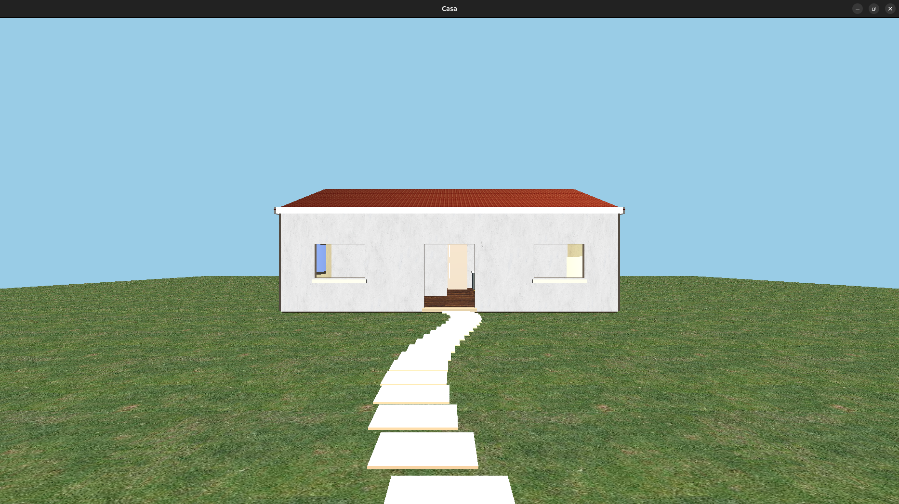

# Projeto Final — Introdução à Computação Gráfica

Este projeto foi desenvolvido para a disciplina de Introdução à Computação Gráfica e tem como objetivo reunir, em uma única aplicação, os principais conceitos estudados ao longo das atividades práticas da disciplina[cite: 1, 2, 3, 4, 5, 6]. O programa apresenta uma cena tridimensional interativa desenvolvida em C/C++ utilizando OpenGL e GLUT, permitindo a visualização de um ambiente 3D e a movimentação da câmera pela cena. O projeto utiliza transformações geométricas, como translação, rotação e escala, além de recursos de visualização tridimensional, teste de profundidade, iluminação, cores e mapeamento de texturas. Todos os elementos presentes na cena são construídos utilizando primitivas geométricas e cubos texturizados.

---

## Imagem e Vídeo do Programa

https://github.com/Avan1F0nsec4/computer-graphics-project/raw/main/assets/demo.mp4

---

## Como Compilar e Executar

Para executar o projeto, é necessário utilizar um sistema Linux com as bibliotecas e ferramentas necessárias para compilação e execução de aplicações OpenGL. As principais dependências utilizadas são GCC/G++, OpenGL, GLU e GLUT ou FreeGLUT[cite: 1, 2]. No Ubuntu, as dependências podem ser instaladas utilizando o comando `sudo apt install build-essential freeglut3-dev libglu1-mesa-dev`. Após a instalação das dependências, deve-se acessar o diretório do projeto e realizar a compilação. Considerando o arquivo principal como `projeto_final.cpp`, o programa pode ser compilado utilizando `g++ -g projeto_final.cpp -o pro -lGL -lGLU -lglut`. Após a compilação, a aplicação pode ser executada com o comando `./pro`.

---

## Controles
* **Teclas `W` e `S`**: Movem a câmera para frente e para trás.
* **Teclas `A` e `D`**: Rotacionam a visão da câmera.
* **Tecla `ESC`**: Fecha o programa.

---

## 🔍 Principais Problemas Encontrados

Durante o desenvolvimento foram encontrados alguns problemas relacionados principalmente à precisão das coordenadas e ao posicionamento dos objetos na cena (como o alinhamento de móveis e paredes), que inicialmente geravam sobreposições visuais ou falhas de oclusão. Esses detalhes foram corrigidos ajustando milimetricamente os valores de translação e escala no código.

---

## O que pode ser Melhorado (e como fazer)

Como melhorias futuras, o projeto pode incorporar o carregamento de modelos 3D externos (como arquivos OBJ de portas e janelas), estruturando funções dedicadas para o parsing de malhas. Outra melhoria possível seria substituir o uso das funções tradicionais `glBegin()` e `glEnd()` por uma implementação utilizando Vertex Buffer Objects (VBOs) e Vertex Array Objects (VAOs), permitindo um uso mais eficiente da GPU. 

---

## Elementos de cada Atividade Prática

O projeto reúne os elementos desenvolvidos nas atividades práticas realizadas durante a disciplina:
* **Aula Prática 01:** Estrutura básica de funções de callback e primitivas geométricas[cite: 1].
* **Aula Prática 02:** Transformações geométricas, uso de `gluLookAt`, projeção perspectiva e organização com pilhas de matrizes (`glPushMatrix` e `glPopMatrix`)[cite: 2].
* **Aula Prática 03:** Teste de profundidade (`glEnable(GL_DEPTH_TEST)`) para garantia da correta oclusão visual[cite: 3].
* **Aula Prática 04:** Configuração de iluminação e fontes de luz na cena tridimensional[cite: 4].
* **Aula Prática 05:** Mapeamento de texturas utilizando imagens externas carregadas com a biblioteca `stb_image`[cite: 5].
* **Aula Prática 06:** Aplicação de curvas paramétricas e splines de Bézier para modelagem de caminhos e detalhes na cena[cite: 6].

---

## Desenvolvimento

* **Avani Maria da Fonseca:** Desenvolvimento integral de todo o projeto, incluindo a modelagem arquitetônica da cena, estruturação dos ambientes, lógica de movimentação da câmera com colisão, integração do sistema de texturas, implementação das curvas de Bézier, depuração de erros de execução e estruturação completa da aplicação.
